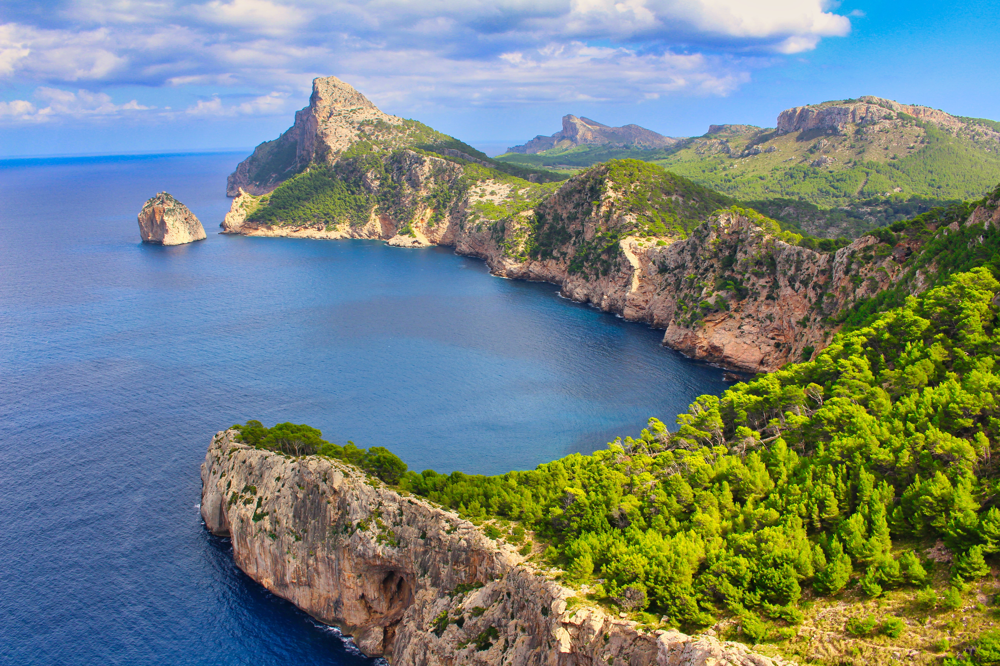

# Urlaub Mallorca

* 2 Wochen - 2 Orten
* [Reisehinweise](https://www.auswaertiges-amt.de/de/aussenpolitik/laender/spanien-node/spaniensicherheit/210534)
* Steckdosen Check: Typ C und F, 230V/50Hz -> kein Adapter

## Todo

* Reisekrankenversicherung
* Koffer
* Spanisch lernen
* Vorfreude!

## Flüge

* **Hinflug**: STR -> PMI, 05. Sep. 13:37
* **Rückflug**: PMI -> STR, 19. Sep. 13:37

## Unterkunft

## Verkehrsmittel

## Reiseplan

